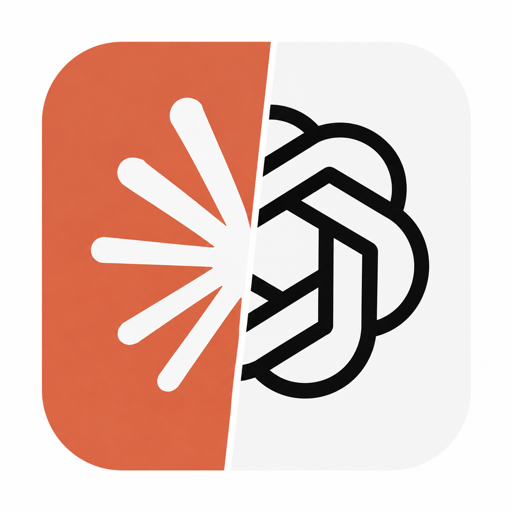

<p align="center">
  
</p>

<h1 align="center">easy agent</h1>

<p align="center">
  面向五款固定 AI 桌面客户端的安全安装助手<br />
  <sub>A fail-closed installer assistant for five AI desktop clients.</sub>
</p>

<p align="center">
  <a href="LICENSE"></a>
  
  
  
</p>

<p align="center">
  <a href="#安装">安装</a> ·
  <a href="#它如何工作">工作方式</a> ·
  <a href="#平台与交付状态">平台状态</a> ·
  <a href="#安全边界">安全边界</a> ·
  <a href="docs/installation.md">完整安装指南</a> ·
  <a href="CONTRIBUTING.md">参与贡献</a>
</p>

> [!IMPORTANT]
> `easy agent` 目前处于安全验证阶段，而非已签名的终端用户发行版。它不会通过跳过校验、绕过 Gatekeeper 或猜测下载地址来假装“可安装”。请只从 [GitHub Releases](https://github.com/wangduoyu414-cell/easy-agent/releases) 下载将来发布的已签名制品；当前可用的是下方列出的本地构建和验证路径。

## 30 秒了解

`easy agent` 管理固定的五款客户端：WorkBuddy、Hermes Agent、CC Switch、Claude Desktop 和 ChatGPT。它不是软件管家，也不执行来自网页的脚本；它把官方入口、允许跳转的主机、包类型、签名主体、Bundle/Package 身份和架构规则编译进应用，以“证据不足即停止”为原则执行安装。

| 你会得到什么 | 它如何做到 |
| --- | --- |
| 一个简洁的原生桌面界面 | 识别本机平台和已安装版本，逐项显示安装/更新状态。 |
| 只使用固定官方来源 | 远端响应只能更新版本、短期 URL、摘要和签名，不能扩展信任边界。 |
| Windows 与 macOS 的同一安全编排 | 私有暂存下载、摘要/签名/身份/架构验证、执行前二次绑定、安装后版本复检。 |
| 可解释的失败 | 不支持、验证待完成、取消、下载失败和“结果未知”被明确区分，不伪造成功。 |

## 安装

详细步骤、签名校验和排错见 [完整安装指南](docs/installation.md)。选择适合你的路径：

| 场景 | Windows | macOS |
| --- | --- | --- |
| 使用正式发行版 | 正式签名 EXE 发布后，从 [Releases](https://github.com/wangduoyu414-cell/easy-agent/releases) 下载 `easy-agent-windows-*.exe`。 | Developer ID 签名并公证的 DMG 发布后，从 Releases 下载 `easy-agent-macos-universal.dmg`。 |
| 本地试运行 | 安装 Rust 后运行 `cargo run --release`。 | 安装 Xcode Command Line Tools 与 Rust 后运行 `cargo run --release`。 |
| 构建可携带验证包 | `./packaging/build-windows.ps1 -Architecture x64` | `ALLOW_UNSIGNED_MACOS_BUILD=1 ./packaging/build-macos.sh` |
| 验证产物完整性 | `Get-FileHash -Algorithm SHA256 .\dist\easy-agent-windows-x64.exe` | `shasum -a 256 dist/easy-agent-macos-universal.dmg` |

当前没有可宣称为生产级的终端用户安装包。未公证的 macOS 验证 DMG 会被 Gatekeeper 拒绝，这是预期安全行为；请不要要求用户关闭 Gatekeeper 或移除 quarantine 来绕过它。

## 它如何工作

```text
检测平台与现有安装
        ↓
解析内置的官方分发合同
        ↓
私有暂存下载 + 受控重定向
        ↓
摘要 / updater 签名 / 平台签名 / 身份 / 架构验证
        ↓
执行前二次绑定
        ↓
Windows：结构化安装命令     macOS：只读挂载或安全展开 → 原子替换 .app
        ↓
安装后精确身份、架构和版本复检
```

在 macOS 上，应用自身是一个包含 Intel 和 Apple Silicon slice 的 Universal `.app`；下游包按照实际硬件而非当前进程 slice 选择。DMG 只读挂载，ZIP/tar.gz 在展开前后检查路径穿越、链接逃逸、重复路径和大小上限；新应用先在目标卷的私有暂存目录复验，再原子替换，最终复验失败会恢复旧版本。

## 平台与交付状态

| 平台 | easy agent 应用 | 厂商客户端操作 | 当前结论 |
| --- | --- | --- | --- |
| Windows x64 | 原生单文件 EXE 构建链已具备 | 五款产品的受控解析/验证/执行链已实现 | 干净机首次安装与更新矩阵仍待关闭。 |
| Windows ARM64 | 已提供构建和 CI 验证入口 | 取决于各厂商是否提供原生包 | 需 Windows ARM64 真机/工具链证据。 |
| macOS Intel | Universal 应用、检测、验证、原子复制/回滚已实现 | 所有厂商条目保持禁用 | Intel 只读取证已完成；干净机安装/更新矩阵待完成。 |
| macOS Apple Silicon | 同一 Universal 应用原生运行 | 所有厂商条目保持禁用 | 静态制品/身份已核验，仍需真实 ARM64 安装矩阵。 |

macOS 目前的禁用不是功能降级：它是刻意的 fail-closed 状态。具体阻塞项包括 WorkBuddy 官方 API SHA-256 与 CDN 完整 ZIP 不一致、Claude 稳定重定向的 Cloudflare challenge、Apple Silicon 真机矩阵，以及本应用正式发布所需的 Apple Developer ID 与 notarization 凭据。完整证据见 [macOS Intel 只读取证](evidence/macos-intel-readonly-proof-2026-08-04.md) 和 [实现状态](docs/implementation-status.md)。

## 安全边界

- 只管理五款固定客户端；不做通用插件、第三方镜像、远程规则平台或后台服务。
- 不执行服务器返回的 PowerShell、Shell 或安装参数；平台命令均由本地编译代码构造。
- 下载在私有临时目录进行，限制重定向、文件名和大小；完整 URL、用户目录和临时目录会从操作日志中脱敏。
- Windows 使用固定系统工具、Authenticode/AppX 身份和架构检查；ChatGPT 不会偷偷回退到 Store、WinGet、引导器或登录页。
- macOS 固定 Applications 中的应用名、Bundle ID、Developer Team ID、主 Mach-O slice、codesign 和 Gatekeeper 结果；不清除 quarantine。
- 任一验证缺失、身份变化或版本合同变化时，默认停止并给出原因。

## 支持的客户端

| 客户端 | Windows 分发策略 | macOS 分发策略 |
| --- | --- | --- |
| WorkBuddy | 官方更新接口 + Authenticode / 最终 EXE 复检 | 官方架构 ZIP + SHA-256 + Bundle/Team ID 复检 |
| Hermes Agent | 官方 bootstrap，桌面与 runtime 状态分离 | Apple Silicon DMG bootstrap；Intel 明确不支持 |
| CC Switch | 官方 `latest.json` + minisign + MSI | 官方签名 `tar.gz` + minisign + `.app` 复检 |
| Claude Desktop | 官方 MSIX | 官方 Universal DMG |
| ChatGPT | OpenAI 官方清单 + 完整 MSIX | OpenAI 官方 Intel / Apple Silicon appcast ZIP |

“支持”描述的是已编码的安全合同，不代表某个平台已绕过所有发布验证 Gate。点击操作仅在对应信任条目和平台证据都闭合后才会变为可用。

## 开发与验证

```bash
cargo fmt --all -- --check
cargo test --all-targets
cargo clippy --all-targets --all-features -- -D warnings
cargo check --all-targets --target x86_64-apple-darwin
cargo check --all-targets --target aarch64-apple-darwin
```

品牌资源包含原始 PNG、运行时 PNG、Windows `.ico` 和 macOS `.icns`。`cargo test --test branding_contract` 会检查窗口、Windows 资源脚本与 macOS Bundle 的名称/图标一致性。图标来源和维护说明见 [assets/branding](assets/branding/README.md)。

## 文档、贡献与传播

- [完整安装指南](docs/installation.md)：正式发行版、本地构建、验证 DMG 和校验方法。
- [GitHub 首页设计记录](docs/github-homepage-design.md)：对 Ollama、Tauri、LocalSend、RustDesk 的主页模式调研与本仓库取舍。
- [实现与验证状态](docs/implementation-status.md)：已完成能力、可复现实证与未关闭 Gate。
- [easy agent macOS 品牌构建证据](evidence/easy-agent-branding-macos-proof-2026-08-04.md)：新图标、Universal DMG、签名、挂载和 Intel 启动验证。
- [维护手册](docs/maintenance.md)：更新信任根、官方来源和平台证据时必须遵守的规则。
- [参与贡献](CONTRIBUTING.md)：测试要求、文档规范与安全变更流程。

欢迎提交可复现的问题、平台验证证据和文档改进。涉及下载源、签名、Bundle/Package 身份、架构或安装行为的变更必须附带官方依据与可复核证据；请勿在 Issue 中粘贴令牌、账号信息或完整临时下载 URL。

## 许可

本项目使用 [MIT License](LICENSE)。第三方客户端及其商标、安装包和服务条款均归各自权利人所有；`easy agent` 不镜像、不再分发或长期缓存这些安装包。
